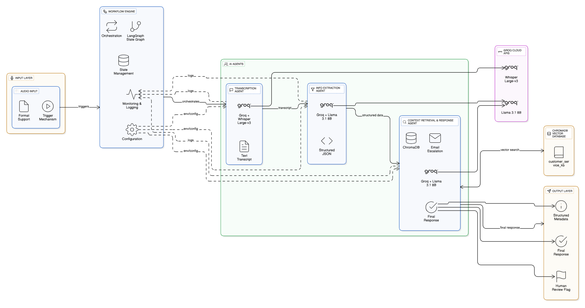

# 🎯 Telecom Customer Support - AI Agentic Framework

---

### Overview

A multi-agent AI system designed specifically for telecom customer support that processes customer audio queries through sequential AI agents to provide intelligent, context-aware solutions. Implements a sophisticated agent workflow with human-in-the-loop validation.

---

## Hosted APP URL

---

### System Architecture

---

### Agent Workflow:
1. **🎙️ Transcription Agent** - Converts speech to text using Whisper with 95%+ accuracy
2. **😊 Sentiment Analysis Agent** - Analyzes emotional tone and customer satisfaction level  
3. **🔍 Information Extraction Agent** - Identifies key topics, issues, and customer intent
4. **📚 Context Retrieval Agent** - Finds similar past solutions using semantic search
5. **💬 Response Generation Agent** - Creates empathetic, context-aware responses

---

### Technical Stack
| Component | Technology Used |
|-----------|-----------------|
| **Speech-to-Text** | Groq Cloud + Whisper Large-v3 |
| **Language Models** | Groq Cloud + LLaMA 3.1 8B Instant |
| **Agent Orchestration** | LangGraph State Graph |
| **Vector Database** | ChromaDB |
| **Frontend Framework** | Streamlit |
| **Backend** | Python 3.8+ |

---

### Domain-Specific Intelligence
- **Telecom-focused** - Specialized for mobile plans, internet services, billing issues, network problems
- **Sentiment-aware responses** - Tailored communication based on customer emotion
- **Contextual understanding** - Leverages past cases for proven solutions

---

### Dual User Roles
- **👤 Customer** - Submit audio queries and receive AI-generated solutions
- **👨‍💼 Support Engineer** - Review, edit, and approve AI responses before knowledge base integration

---

### Data Sources:
- **ChromaDB Vector Store** - Semantic search across past cases
- **Human-approved solutions** - Quality-controlled responses
- **Continuous learning** - Improves with every interaction

---

### Features:
- **Real-time indexing** - Instant knowledge base updates
- **Semantic search** - Finds relevant past solutions
- **Case management** - Track pending and approved cases
- **Quality assurance** - Human validation before deployment

---

### Prerequisites
- Python 3.8+
- Groq API Key
- Streamlit Account (for deployment)

---

## 🎬 Demo

[https://github.com/mykeysid10/Bits-CAI-G71-A2/blob/main/Hosted_Demo_Recording.mp4](https://github.com/user-attachments/assets/318c41d7-6208-424b-a6cb-167a83a94750)
